  

---

  <table border="0" cellspacing="0" cellpadding="0" align="center" style="border: none; border-collapse: collapse; width: 100%;">
    <tr style="border: none;">
      <td style="border: none; padding: 20px; width: 55%; vertical-align: middle;">
        <h2 style="color: #ff003c; font-family: 'Courier New', Courier, monospace; margin-top: 0; letter-spacing: 2px;">OVERVIEW // INITIALIZATION</h2>
        

          Hari Vignesh A is an active systems engineer and full-stack developer specializing in high-performance web systems, custom interactive layouts, and robust application architectures. Leveraging Next.js, React, TypeScript, and Java, he builds clean, secure, and visually premium products designed for high-density environments.
        

      </td>
      <td style="border: none; padding: 20px; width: 45%; text-align: center; vertical-align: middle;">
        
      </td>
    </tr>
  </table>

---

  

<blockquote style="border-left: 3px solid #ff003c; padding-left: 15px; margin: 20px 0; color: #e0e0e0; font-family: 'Courier New', Courier, monospace; font-size: 13.5px; line-height: 1.6;">
  Engineering high-velocity, type-safe, and visually impactful software. Grounded in code hygiene, minimalist patterns, and optimal database efficiency.
</blockquote>

  
<strong>[01] CURRENT FOCUS:</strong> Designing modular micro-frontends, robust backend APIs, and custom rendering pipelines.

  
<strong>[02] ACADEMICS &amp; RESEARCH:</strong> Working on STEM curriculum models and configuration-driven user interfaces.

  
<strong>[03] COLLABORATION:</strong> Open to performance tuning, library design, and security engineering projects.

---

  

<h4 style="color: #ff003c; font-family: 'Courier New', Courier, monospace; letter-spacing: 1.5px; margin-bottom: 10px;">LANGUAGES_ENV</h4>

  
  
  
  
  

<h4 style="color: #ff003c; font-family: 'Courier New', Courier, monospace; letter-spacing: 1.5px; margin-top: 20px; margin-bottom: 10px;">FRAMEWORKS_ENV</h4>

  
  
  
  

<h4 style="color: #ff003c; font-family: 'Courier New', Courier, monospace; letter-spacing: 1.5px; margin-top: 20px; margin-bottom: 10px;">INFRASTRUCTURE_ENV</h4>

  
  
  
  

---

  

  <table border="0" cellspacing="0" cellpadding="0" align="center" style="border: none; border-collapse: collapse;">
    <tr style="border: none;">
      <td style="border: none; padding: 10px; vertical-align: middle;">
        
      </td>
      <td style="border: none; padding: 10px; vertical-align: middle;">
        
      </td>
    </tr>
  </table>

---

<h3 style="color: #ff003c; font-family: 'Courier New', Courier, monospace; letter-spacing: 2px;">CONNECT // SECURE_LINKS</h3>

  
  

